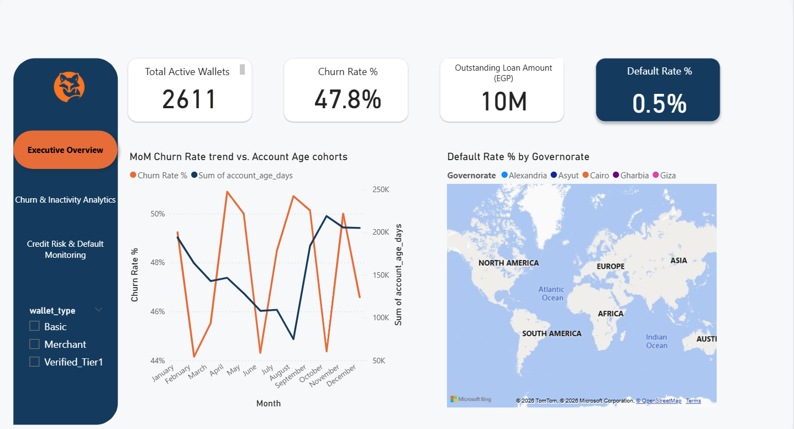
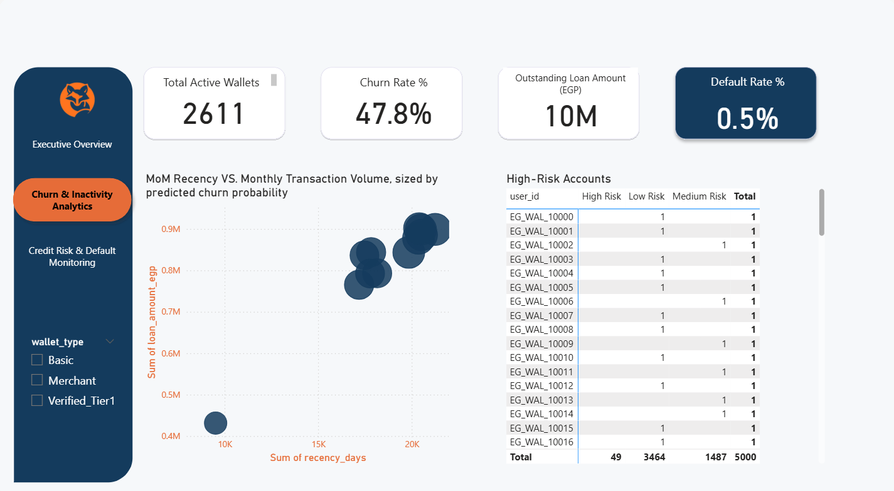
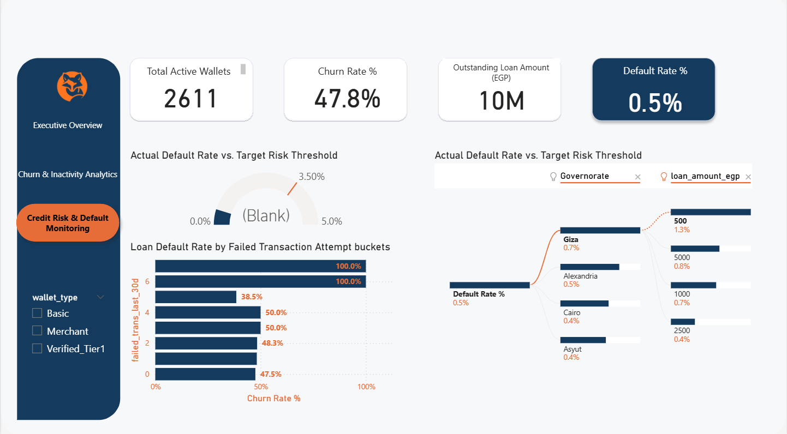

# Fintech Credit Risk & Churn Analytics Dashboard

An end-to-end analytics platform built to monitor digital wallet churn, evaluate credit risk exposure, and segment high-risk accounts across customer tiers and governorates in Egypt.

---

## 📌 Executive Summary

* **Total Active Wallets**: 2,611
* **Overall Churn Rate**: 47.8%
* **Outstanding Loan Portfolio**: 10M EGP
* **Portfolio Default Rate**: 0.5%

---

## 📊 Key Dashboard Views

### 1. Executive Overview

Tracks high-level KPI performance across the customer lifecycle, featuring MoM churn rate trajectories aligned against account maturity cohorts and geographic default distribution across Egyptian governorates (Giza, Cairo, Alexandria, Asyut, Gharbia).

### 2. Churn & Inactivity Analytics

Analyzes the drivers behind customer churn (47.8%) by cross-referencing recency vs. monthly transaction volumes sized by predicted churn probability. Includes predictive risk segmentation breakdown (`High Risk`, `Medium Risk`, `Low Risk`) by individual wallet IDs.

### 3. Credit Risk & Default Monitoring

Monitors credit performance by mapping actual default rates against target thresholds. Highlights risk concentration using decomposition trees across regions (Giza showing peak default rates at 0.7%) and loan amount brackets (e.g., 500K EGP micro-loans displaying 1.3% default rate).

---

## 🛠️ Data Pipeline & Architecture

* **Database / Processing**: PostgreSQL & Python (Data Cleaning, Feature Engineering, Risk Bucket Modeling)
* **Visualization**: Power BI (DAX measures, Dynamic Page Navigation, Custom Slicers by Wallet Tier: *Basic*, *Merchant*, *Verified_Tier1*)
* **Metrics Tracked**: Recency (Days), Failed Transaction Attempts (30D), Monthly Transaction Volume, Default Rate %

---

## 🚀 Key Business Insights

* **High Churn Threshold**: A 47.8% churn rate highlights significant drop-offs after initial onboarding; inactivity correlates directly with accounts exhibiting 4+ failed transaction attempts in 30 days.
* **Geographic & Loan Size Risk**: Micro-loans (500K EGP) in specific governorates like Giza present higher relative default risk (1.3%) compared to higher loan brackets.
* **Proactive Risk Mitigation**: 49 accounts currently flagged under the **High Risk** segment account for immediate retention and credit recovery intervention.
